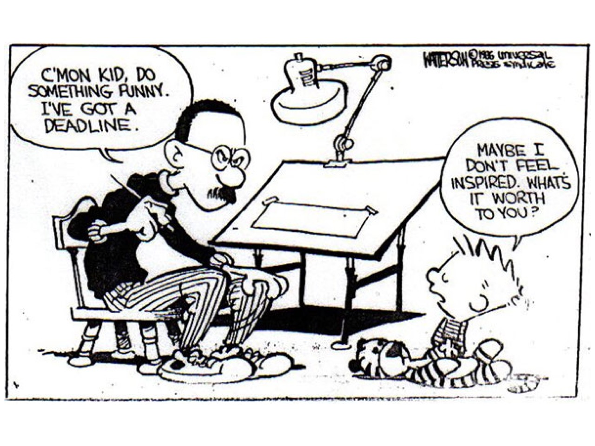
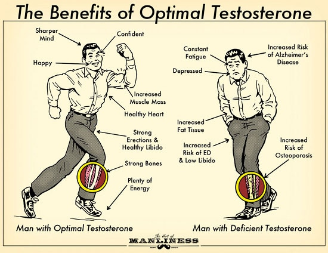

# Projects
 | <b>Projects</b> | 
* * *

Here are some of the projects I have worked on in freecodecamp and developing my skills in html, css.styles and javascript.

## Survey Form

    

* <u>About</u>: This was my first html and css.styles project in freecodecamp and showed me the ropes for both. This project opened the door for me learning html and css.styles and showed me how I can personalize something as simple as a survey and add my own touches to it.

* * *

## Tribute Page

    

* <u>About</u>: This is my Tribute Page project from freecodecamp. Here I shared my love and enjoyment for Calvin and Hobbes and made a tribute to the author of Calvin and Hobbes, Bill Watterson. This gave me an opportunity to further my skills in html and css.styles while showing my appreciation for a comic that I've grown up with.

* * *

## Technical Document

        
    </a>

* <u>About</u>: This is the Technical Document project from freecodecamp. I filled the page with information about testosterone and how to maintain and increase one's naturally. This project increased my skills on html and css.styles and gave me freedom to show my knowledge on another topic I enjoy which is health and wellness.

* * *

## Product Landing Page

    

* <u>About</u>: This is a Product Landing Page from freedcodecamp. With this project, I was tasked to create a landing page for a product. I opted to go with a product that I know and use myself and added my own twist to it. In working on this project it increased my knowledge and skill with html and css.styles.

* * *